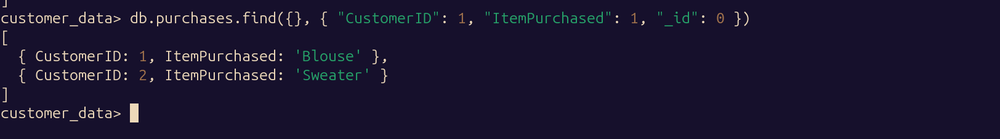

# Customer Behavior Analytics with Apache NiFi and MongoDB

## Prerequisites

- Install Docker and Docker Compose

## Step 1: Clone the Repository

Start by cloning the repository:

```bash
git clone https://github.com/1abdelhalim/Customer-Behavior-Analytics-with-Apache-NiFi-and-MongoDB.git
cd Customer-Behavior-Analytics-with-Apache-NiFi-and-MongoDB
```

## Step 2: Run Docker Compose

Run the following command to start the services for Apache NiFi and MongoDB:

```bash
docker-compose up
```

This will start the following services:

- **Apache NiFi** on port `8080`
- **MongoDB** on port `27017`
- **Mongo Express** on port `8081` (MongoDB GUI)

You can access the NiFi UI at [http://localhost:8080/nifi](http://localhost:8080/nifi) and Mongo Express at [http://localhost:8081](http://localhost:8081).

## Step 3: Set Up Data Ingestion with Apache NiFi

1. Open the NiFi UI by navigating to [http://localhost:8080/nifi](http://localhost:8080/nifi).

2. Create a Data Ingestion Flow:
   - Add a `GetHTTP` processor to pull the dataset from the URL.
   - Add a `ConvertRecord` processor to convert the CSV data into JSON format.
   - Add a `PutMongo` processor to insert the JSON data into MongoDB.

3. Configure the Processors:
   - For `GetHTTP`, use the following URL for the dataset:

   ```bash
   https://raw.githubusercontent.com/vn-quant/Consumer-Behavior-and-Shopping-Habits/R/shopping_behavior_updated.csv
   ```

   - Configure `PutMongo` to insert data into the `customer_data` database in MongoDB under the `purchases` collection.

4. Start the Data Flow to ingest the data into MongoDB.

## Step 4: Run MongoDB Analytics Queries

Once the data is ingested into MongoDB, we can run analytics queries to derive insights. The queries are provided in the `queries/analytics_queries.js` file.

### Example Queries

- **Find a specific Customer**


- **Aggregation by Category**:


## Step 5: Explore Data with Mongo Express

You can explore and validate the ingested data using the Mongo Express UI, which is accessible at [http://localhost:8081](http://localhost:8081). Mongo Express provides a visual interface for viewing MongoDB collections, running queries, and managing the database.
